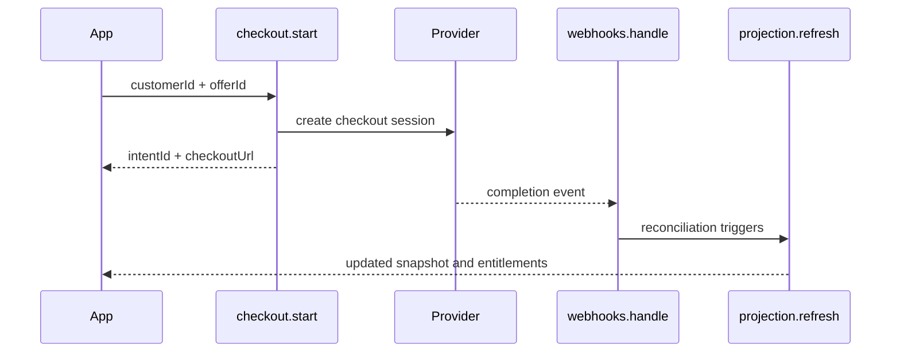

The public SDK exposes a workflow-oriented surface instead of a provider-API surface.

## Major workflow groups

<ApiTable
  nameLabel="Workflow group"
  descriptionLabel="Examples"
  rows={[
    {
      key: "ingress",
      name: Checkout and webhook ingress,
      description: <><code>checkout.start</code>, <code>webhooks.handle</code>, <code>webhooks.replay</code></>
    },
    {
      key: "portal",
      name: Portal and subscription ops,
      description: (
        <><code>portal.createSession</code>, <code>subscriptions.cancel</code>, <code>subscriptions.change</code>, <code>subscriptions.pause</code>, <code>subscriptions.resume</code>, <code>subscriptions.previewChange</code></>
      )
    },
    {
      key: "purchase",
      name: Purchase and credit ops,
      description: <><code>purchases.refund</code>, <code>credits.grant</code>, <code>credits.consume</code></>
    }
  ]}
/>

## Workflow receipts

Mutation-style workflows return a `WorkflowReceipt`. That is a useful public concept because it describes what actually happened:

which workflow ran, which stages completed, whether an intent was created, which normalized events were emitted, and which reconciliation steps were implied downstream.

## Why this surface exists

Applications usually care about business operations, not raw provider methods.

For example, "refund this purchase" is a better app-level boundary than "call provider refund API and then manually patch local tables."

## Workflow guarantees Purchase is aiming for

The workflow surface is aiming for explicit input and output types, idempotent event handling, replay-safe webhook processing, provider-normalized state transitions, and app-readable receipts and projections.

## Example flow: checkout to projection

## Why stage-aware receipts matter

Billing operations can fail halfway through the business process even if a provider API call succeeded. Stage-aware receipts make it much easier to reason about:

what input was accepted, whether provider state changed, whether local facts were persisted, and whether read-side reconciliation is still required.

## Design focus

The hard parts are the invariants across projection and workflow stores, partial-failure semantics, and cross-provider lifecycle normalization.

Those concerns are exactly why the workflow-first public shape is the right abstraction boundary for the project.
