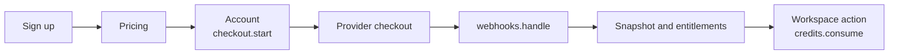

This section turns `examples/nextjs` into a concrete walkthrough for building a SaaS billing app with Purchase.

The example is intentionally small, but it already demonstrates the whole shape of a commercial application:

- authentication and app-owned customers
- public pricing and catalog reads
- signed-in checkout launch
- webhook ingestion
- account activity and entitlements
- prepaid credit consumption

## Stack

- Next.js App Router
- Better Auth
- Cloudflare D1
- Purchase runtime
- Stripe or Paddle

## Why this example matters

The goal is not only to show isolated SDK calls. The goal is to show the application boundary around billing:

- how product pages read the catalog
- how authenticated users start checkout
- how webhooks update durable state
- how account pages render ownership and activity
- how workspace actions consume credits

## Journey

