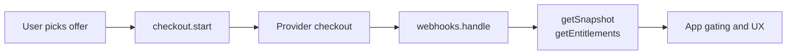

Purchase exposes a small set of runtime groups that application code uses repeatedly.

## Runtime setup

Runtime setup is built from an SDK service, the shared `Pay` layer, a provider layer, and a provider registry.

<ApiTable
  nameLabel="Piece"
  descriptionLabel="Role"
  rows={[
    { name: "BaseSDK(...)", description: "Creates the public SDK surface used by application code." },
    { name: "Pay.layer(Pay)", description: "Wires the core workflow services." },
    { name: "Stripe.layer / Paddle.layer", description: "Adds provider-specific API and webhook behavior." },
    { name: "PayProvider.FromTags(...)", description: "Registers providers behind the shared provider interface." }
  ]}
/>

## Checkout

Use checkout from a stable commercial `offerId`, not from a provider-native price id.

The main calls are `sdk.checkout.start(...)` for launching a checkout workflow and `sdk.checkout.getIntent(...)` for reading the durable local intent.

## Customer reads

These are the main read APIs your app will use after workflow completion.

<ApiTable
  rows={[
    { name: "sdk.customer.getSnapshot(...)", description: "Read the current projected customer state." },
    { name: "sdk.customer.refreshSnapshot(...)", description: "Rebuild the projection after workflow or webhook changes." },
    { name: "sdk.customer.getEntitlements(...)", description: "Read the customer entitlement set." },
    { name: "sdk.customer.computeEntitlements(...)", description: "Compute entitlement output from available state." }
  ]}
/>

## Subscriptions

Subscription APIs cover the operational lifecycle: read current state, preview a change, apply a change, cancel, pause, or resume. The public surface is intentionally grouped under `sdk.subscriptions` so app code does not branch on provider-native subscription objects.

## Purchases and credits

Purchase and credit APIs handle post-checkout commercial state: refunds, purchase grants, wallet reads, credit grants, and credit consumption. Use explicit idempotency keys for write operations that may be retried.

## Webhooks and portal

Webhook ingestion should go through `sdk.webhooks.handle(...)`; operational replay should go through `sdk.webhooks.replay(...)`. Customer self-service entry points use `sdk.portal.createSession(...)`.

## Typical application flow

## Practical usage advice

- prefer `offerId` over provider ids in app code
- treat checkout and mutation APIs as command-side workflows
- treat snapshot and entitlement APIs as read-side queries
- log workflow receipts and webhook results
- keep product policy in your app, not inside provider event parsing
