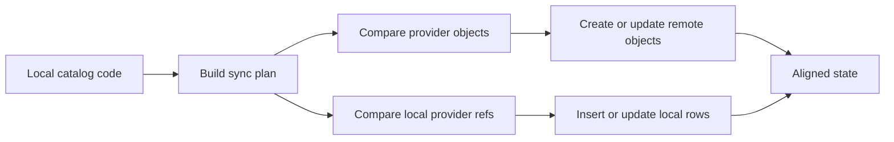

Purchase includes a CLI path for catalog synchronization.

## What it does

The catalog sync flow compares your local Purchase catalog with provider and local storage state. It produces a concrete plan across provider objects and local rows.

<ApiTable
  nameLabel="Plan area"
  descriptionLabel="Examples"
  rows={[
    {
      key: "provider",
      name: Provider objects,
      description: "Products and prices to create or update."
    },
    {
      key: "local",
      name: Local storage,
      description: "Rows and provider references to insert or update."
    },
    {
      key: "drift",
      name: Drift review,
      description: "Stale rows, missing refs, and archive candidates."
    }
  ]}
/>

## Why sync exists at all

Catalog authoring in code is only half the job. Stripe and Paddle still need concrete remote products and prices. Without sync tooling, teams usually fall back to manual dashboard work, and then drift begins:

- a new plan is only partially created
- local provider refs stop matching remote objects
- teams do not know whether a rename is safe
- the provider dashboard becomes the real source of truth

Catalog sync is the operational control point that keeps those systems aligned.

## Why this is important

The catalog is code, but providers still need corresponding product and price objects. Sync tooling keeps those two worlds aligned without forcing your team to click around dashboards manually.

## Database targets in the CLI

The current CLI code supports SQLite, PostgreSQL, and Cloudflare D1 over HTTP.

## Sync lifecycle

## Usage direction

The exact production workflow will keep evolving, but the intended operating model is clear:

1. Define catalog in code
2. Run sync in dry-run mode
3. Review the plan
4. Apply sync
5. Keep provider refs and local rows under source-controlled catalog ownership

## Recommended practice

- review dry-run output before applying
- avoid manual dashboard edits once sync is adopted
- keep provider mappings explicit in code
- treat commercial id renames as migrations, not copy edits
