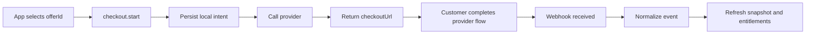

Checkout starts from a stable commercial `offerId`, not a provider price id.

## Why that matters

Your app should decide what it sells in its own vocabulary:

- which customer is buying
- which commercial offer is selected
- where to return after success or cancel
- what metadata should travel with the workflow

The provider adapter then maps that to Stripe or Paddle objects.

## Example

```ts
const checkout =
  yield *
  sdk.checkout.start({
    customerId,
    offerId: "app:pro_monthly",
    successUrl: "https://app.example.com/settings/billing/success",
    cancelUrl: "https://app.example.com/settings/billing/cancel",
    metadata: {
      source: "pricing_page"
    }
  })
```

## Result shape

The runtime returns one durable checkout result: selected provider, app customer id, product id, offer id, checkout session id, hosted checkout URL when available, and the local checkout intent id.

At the lower workflow layer, the result also carries a normalized checkout target, which connects the commercial `offerId` to the active provider and any provider-native references needed to create checkout.

## Checkout lifecycle



## Recommended app pattern

1. Create or resolve your app customer first
2. Start checkout with a stable `offerId`
3. Redirect the user to the returned provider URL
4. Let webhooks finalize durable lifecycle state
5. Refresh the customer snapshot after completion

Do not treat the browser redirect alone as proof of payment completion. The durable source of truth should come from the workflow plus webhook path.

## Why this beats provider price-id checkout

If the application starts checkout from provider-native ids, the provider becomes the source of truth for your commercial model. Starting from `offerId` keeps the business vocabulary inside your own code and lets Purchase do the mapping.
